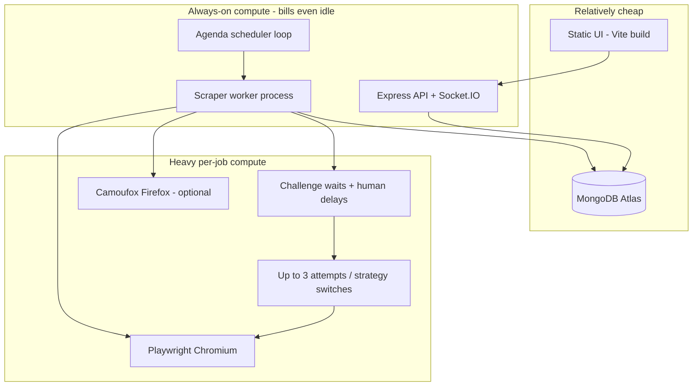

# Scout-X — Compute Power Analysis (Why Deploy Is Expensive)

**Purpose:** Explain in detail **what burns compute**, **why this project is costly to host**, and **where you can reduce usage** without guessing.  
**Related docs:** `SCHEDULER-AND-SCRAPER.md`, `SCOUT-X-HOSTING-PLAN.md`, `render-free-tier-env.md`, `DEPLOYMENT-PLATFORM-COMPARISON.md`, `render.yaml`

---

## 1. Bottom line (read this first)

Scout-X is **not** a normal web API. Most of its cost is **not** “how many companies you scrape.” It is:

1. **Always-on processes** (API + Agenda scheduler + scraper worker) that bill for **instance hours** whether scrapes run or not.
2. **Playwright Chromium** (a full browser) that needs **~300 MB–2+ GB RAM** and significant **CPU** every time a job runs.
3. **Heavy builds** that download/install Chromium and compile TypeScript — burning **build/pipeline minutes** on every redeploy (and on crash-redeploy loops).
4. **Retries, anti-bot waits, and concurrency** that multiply browser time and memory spikes.

**Verdict:** On free/tiny hosts this feels “too expensive / too heavy” because the product’s core work *is* browser automation. You can **trim** a lot of waste, but you **cannot** make a Chromium scraper as cheap as a simple Node CRUD app.

| Rank | What burns the most | When it burns | Typical impact |
|------|---------------------|---------------|----------------|
| **#1** | Always-on API / worker instance hours | 24/7, even with zero scrapes | Main free-tier “limit reached” cause |
| **#2** | Chromium / Playwright per scrape | Every run (manual or scheduled) | RAM spikes, OOM, CPU, bandwidth |
| **#3** | Build + `playwright install chromium` | Every deploy / rebuild | Pipeline minutes + disk |
| **#4** | Retries / Camoufox / visible browser | Failed or anti-bot runs | 2–3× browser cost per job |
| **#5** | Parallel concurrency (`SCRAPER_WORKER_CONCURRENCY`) | Multiple jobs at once | Multiplies #2 |
| **#6** | Socket.IO + Mongo polling + Node heap | Continuously | Smaller than browser, but not free |
| **#7** | Static frontend | Build + CDN serve | Cheap comparatively |

---

## 2. What “compute power” means for this project

Cloud bills and “limit reached” emails usually mix several meters. Scout-X hits **all** of them:

| Meter | What it is | How Scout-X uses it |
|-------|------------|---------------------|
| **Instance hours / CPU time** | How long a server is running (and how hard the CPU works) | API must stay up for schedules; worker must stay up to process Agenda jobs |
| **RAM (memory)** | Working space for processes | Chromium is the giant; Node must share the same container limit |
| **Build / pipeline minutes** | Time spent installing deps and compiling | `npm ci` + `tsc` + Playwright Chromium download every deploy |
| **Outbound bandwidth** | Bytes sent/received | Loading job sites, assets, retries, optional screenshots |
| **Disk** | Browser binaries + logs + node_modules | Chromium install is hundreds of MB |

**Important:** Render (and similar PaaS) do **not** charge by “number of companies scraped.” Six light scrapes can still exhaust quotas if two services run all month or if Chromium OOMs and restarts repeatedly.

---

## 3. Architecture — where compute lives



### Process layout options

| Layout | Processes | Compute effect |
|--------|-----------|----------------|
| **Separate API + Background Worker** (classic Render guide) | 2 always-on services | ~**2× instance hours**; safer isolation; costly on free tier |
| **Embedded workers** (`RUN_EMBEDDED_WORKERS=true`) | 1 process: API + Agenda + scraper | ~**1× instance hours**; API and Chromium **share one RAM pool** — riskier on 512 MB |
| **API + Worker + remote browser service** | 3+ processes | Best isolation at scale; **most expensive** early on |
| **API + Worker + Camoufox sidecar** | Extra Python + Firefox | Stronger anti-bot; **much more RAM/CPU** |

Current free-tier Blueprint (`render.yaml`) uses **one backend** with embedded workers — correct for saving hours, still RAM-tight because Chromium shares the box with Node.

---

## 4. Detailed compute consumers

### 4.1 Always-on API + Agenda (baseline burn)

**Code:** `server/src/server.ts`, `server/src/queue/scraperQueue.ts`, `server/src/services/automationScheduler.ts`

**What it does while “idle”:**
- Keeps Express + Socket.IO listening.
- Agenda polls MongoDB for due jobs (`AGENDA_PROCESS_EVERY`, default **10 seconds**).
- On boot, `rehydrateAutomationSchedules` re-registers enabled crons.
- Optional queued-run polling (`QUEUED_RUNS_POLL_MS`) hits the DB for UI updates.

**Why it costs money:**
- Schedules only fire if **something is awake**. Sleeping free web services miss crons.
- One always-on free service ≈ **24 × 30 ≈ 720 instance hours/month** — almost the entire Render free allowance (~750).
- Two always-on services ≈ **~1440 hours** → over limit mid-month **with zero scrapes**.

**CPU when idle:** Low–moderate (event loop + DB polls).  
**RAM when idle (no browser):** Often tens–low hundreds of MB for Node alone — already a large slice of 512 MB before Chromium starts.

**Can we reduce it?** Yes (see §6) — merge services, slow Agenda/poll intervals, pause schedules, avoid separate free worker.

---

### 4.2 Scraper worker + job concurrency (multiplies browser cost)

**Code:** `server/src/workers/scraperWorker.ts`, `SCRAPER_WORKER_CONCURRENCY` in `scraperQueue.ts`

**Defaults:**
- Production code default concurrency: **`3`** (`SCRAPER_WORKER_CONCURRENCY || '3'`).
- Free Blueprint override: **`1`**.
- Job timeout default: **`120000` ms** (120s); free Blueprint: **`45000`**.
- Max attempts default: **`3`**; free Blueprint: **`1`**.

**What this means for compute:**

| Setting | Compute effect |
|---------|----------------|
| Concurrency `3` | Up to **3 Chromium instances** at once → ~3× RAM and CPU |
| Timeout `120s` | Each job may hold a browser for up to 2 minutes (+ waits) |
| Max attempts `3` | One logical scrape can mean **3 browser launches** (baseline → Camoufox/visible → rotated identity) |

**Why it feels “too powerful / too costly”:** Defaults are tuned for a **real scraper product** (≥2 GB RAM), not for a 512 MB free box. Leaving defaults on a small host causes OOM → restart → more instance hours and failed/retried work.

---

### 4.3 Playwright / Chromium — the #1 per-job compute hog

**Code:** `server/src/browser-management/browserConnection.ts`, `server/src/services/browserReusePool.ts`, Engine 1 (`maxun-core`) + Engine 2 (`listExtractor.ts`)

**What happens on almost every scrape:**
1. Launch or connect to **Chromium** (or Camoufox).
2. Open a page, navigate to the target site.
3. Optionally wait for Cloudflare / Amazon / Microsoft challenges.
4. Simulate human mouse + delays.
5. Extract list/schema or run recorded workflow steps.
6. Persist rows; destroy/release browser.

**Why Chromium is expensive:**

| Factor | Detail |
|--------|--------|
| **RAM** | Headless Chromium commonly needs **~300 MB–1 GB+**; full pages with JS frameworks push higher. Free Render = **512 MB total** for Node **and** Chromium. |
| **CPU** | Page render, JS execution, scrolling, pagination — continuous CPU while the job runs. |
| **Cold start** | Launching Chromium is slower and spikier than an HTTP `fetch`. |
| **Outside V8 heap** | Chromium is a **separate OS process**. Caping Node with `NODE_OPTIONS=--max-old-space-size=192` is required on free tier so Chromium has room — Node cannot “borrow” unused V8 heap for Chrome. |
| **Binary install** | `npx playwright install chromium` during **build** downloads a large browser; every rebuild burns pipeline minutes and disk. |

**Engine comparison (compute):**

| Engine | Browser pattern | Relative cost |
|--------|-----------------|---------------|
| **Engine 2 — list extraction** | Pooled Playwright page; can block images/fonts/media (and CSS in low-memory mode) | **Lower** (still heavy) |
| **Engine 1 — recorded workflow** | Full remote/local browser session + Interpreter stepping through actions | **Higher** (longer sessions, more interaction) |

Scout-X SaaS / extension path leans on Engine 2, which is the lighter of the two — but “lighter” still means a real browser.

**Low-memory mitigations already in code (`LOW_MEMORY_MODE=true`):**
- Lean Chromium flags (`--renderer-process-limit=1`, `--no-zygote`, smaller renderer JS heap, scale factor 1).
- Close browser after each job (`BROWSER_POOL_IDLE_TTL_MS=0`) — saves idle RAM, **costs more CPU** if jobs are frequent (relaunch tax).
- Skip playwright-extra stealth plugin RSS on tiny hosts.
- Block stylesheets in addition to images/fonts/media.
- Skip isolated-browser fallback / visible retries that would OOM.

---

### 4.4 Anti-bot waits, human simulation, and retries

**Code:** `scraperWorker.ts`, `services/unblocker.ts`

Known tough hosts (Microsoft careers, Amazon jobs, LinkedIn, Workday, Greenhouse, Lever, etc.) trigger **longer waits** and **strategy escalation**:

| Mechanism | Default budget | Free Blueprint | Compute effect |
|-----------|----------------|----------------|----------------|
| Cloudflare wait | 45s | 20s | Holds browser open (RAM + CPU idle-ish but billed) |
| Amazon challenge | 90s | 25s | Same |
| Microsoft challenge | 60s | 25s | Same |
| Human delay / mouse | Per page | Still on | Extra wall-clock time with browser alive |
| Retry strategies | Up to 3 attempts; may switch to **Camoufox** or **visible** Chromium | Max 1; visible retry disabled | Retries are the classic “one scrape = three Chromium spikes” cost amplifier |

**Why this makes deploy costly:** A single “failed” scrape against a protected site can still consume **minutes** of browser time and then **retry with a heavier browser**. On a small instance that often means **OOM → platform restart → more hours**.

---

### 4.5 Camoufox / visible browser / remote browser service

| Mode | Extra compute | When used |
|------|---------------|-----------|
| Local headless Chromium | Baseline heavy | Default fallback / pool |
| Visible Chromium (`headless:false`) | **Heavier** local launch | Retry path on anti-bot hosts (disabled on free via `DISABLE_VISIBLE_BROWSER_RETRY`) |
| Camoufox (Firefox anti-detect) | Separate Python service + Firefox binary | Optional / retry path — needs its **own** RAM |
| Dedicated `browser/` Playwright service | Always-on second Chromium host | Better isolation; **another** always-on bill |

Deploying Camoufox or a remote browser service **on the same small machine** as the API is one of the fastest ways to make the project “too costly / unstable.”

---

### 4.6 Builds and Chromium install (pipeline compute)

From `render.yaml` build command (simplified):

```text
npm ci --include=dev
→ npm run build:server   (TypeScript compile needs ~768 MB heap override)
→ playwright install chromium
```

| Step | Why it burns compute |
|------|----------------------|
| `npm ci --include=dev` | Large dependency tree; must include **devDependencies** because production `NODE_ENV` would skip TypeScript toolchain |
| `tsc` / build:server | CPU + RAM during compile |
| Playwright Chromium install | Large download + unpack — often the **slowest / heaviest** build step |

**Cost trap:** Putting Chromium install in the **start** command re-downloads on every restart, including OOM restarts → endless burn of time and bandwidth. Install belongs in **build** only (`render-free-tier-env.md`).

Frequent redeploys, crash loops, and “fix env and redeploy” cycles are a major reason this project feels expensive even when scrape volume is tiny.

---

### 4.7 MongoDB Atlas (usually not the compute villain)

Agenda jobs, Runs, Robots, ExtractedData all live in MongoDB.

| Aspect | Notes |
|--------|--------|
| **Your app server compute** | Network I/O + serialization; usually small vs Chromium |
| **Atlas cost** | Separate bill (often free/shared early); grows with data volume and indexes |
| **Idle polling** | Agenda every 10s + queued-run polls add steady small load |

Atlas is the **right** place for the DB. It is rarely why Render says “limit reached,” but chatty polling is still worth tuning on free tier.

---

### 4.8 Frontend (cheap)

Static Vite build served from Render Static / Firebase / Cloudflare Pages:

- **Build minutes** on frontend deploys (moderate).
- **No Chromium** on the UI host.
- Negligible runtime compute compared to the scraper.

Splitting UI to Firebase Hosting / Cloudflare Pages (as in the hosting plan) **does** reduce backend pressure slightly and avoids billing a heavy Node box for static files — good practice, not the main fix.

---

### 4.9 Optional destinations (usually small)

Sheets / Airtable / webhooks / n8n / screenshot uploads add:

- Extra HTTP after a scrape.
- Occasional object-storage uploads (`maxun-run-screenshots`).

These matter for **bandwidth** and latency, not for the primary “why is this so heavy?” answer — unless screenshotting is enabled aggressively.

---

## 5. Why deploying this project is “too costly”

### 5.1 Product shape vs cheap hosting

| Cheap host assumption | Scout-X reality |
|-----------------------|-----------------|
| Stateless HTTP handlers, ms–seconds | Browser sessions, tens of seconds–minutes |
| 512 MB is plenty for Node | Chromium alone can exceed 512 MB |
| Sleep when idle is fine | Schedules need wake time / always-on |
| One small web service | Often need API + worker (+ browser) |
| Charge ≈ traffic | Charge ≈ **RAM × hours** + builds |

You are deploying a **browser farm lite**, not a landing-page API. Platforms price that like a small always-on workstation.

### 5.2 Free / Hobby math (Render example)

| Scenario | Approx instance hours / month | Result |
|----------|-------------------------------|--------|
| 1 always-on free service | ~720 | Barely under ~750 free hours |
| 2 always-on (API + worker) | ~1440 | **Over limit** with zero scrapes |
| 1 service + OOM restart loops | Hours + rebuilds | Limit + flaky scrapes |
| Chromium build every push | Pipeline minutes | Separate quota burn |

### 5.3 “We only scraped 6 companies” myth

Each company/automation run may:

1. Start Chromium (hundreds of MB).
2. Wait on anti-bot (20–90+ seconds with browser alive).
3. Paginate / scroll / extract up to the job timeout.
4. Retry up to 3 times with heavier strategies (if not capped).
5. Share a box already spending hours 24/7.

So **6 companies ≠ 6 cheap API calls**. They can mean many minutes of browser CPU/RAM **on top of** a full month of instance hours.

### 5.4 Paid hosting is still “compute heavy” — just correctly sized

Even on DigitalOcean / Hetzner / Railway, expect:

| Stage | Rough machine | Why |
|-------|---------------|-----|
| Demo / free | 512 MB | Unreliable; starve Chromium |
| First real use | **≥2 GB RAM**, 1 scrape at a time | Minimum sane Chromium room |
| Safer sales | **4 GB RAM** | Fewer OOMs; concurrency 2–3 |
| Many customers | Split API / worker or Browserless | Don’t put all Chrome on one login box |

Ballpark always-on VPS: often **~$15–40/month** for sellable Phase 1 — cheap vs AWS at scale, **not** free, because Chrome must stay possible.

---

## 6. Where we *can* reduce compute power

These are real levers in **this** codebase. Each has a trade-off.

### 6.1 High impact (do these first)

| Lever | How | Saves | Trade-off |
|-------|-----|-------|-----------|
| **One process, not two** | `RUN_EMBEDDED_WORKERS=true`; do **not** run a separate free Background Worker | ~**50% instance hours** vs API+worker | Chromium and API share RAM; scrape spikes can hurt API |
| **Concurrency = 1** | `SCRAPER_WORKER_CONCURRENCY=1` | Prevents 2–3× RAM spikes | Jobs queue instead of parallel |
| **Enough RAM or don’t scrape** | ≥2 GB paid/VPS for real use; stop expecting free 512 MB to run Chrome | Stops OOM restart loops (hidden cost) | Monthly $ |
| **Max attempts = 1 on tiny hosts** | `SCRAPER_MAX_ATTEMPTS=1` | Avoids second/third Chromium launch | More failed runs on hard sites |
| **Disable visible / Camoufox on small boxes** | `DISABLE_VISIBLE_BROWSER_RETRY=true`; don’t run Camoufox sidecar on same 512 MB–2 GB box | Huge RAM/CPU cut | Weaker anti-bot success |
| **Pause unused schedules** | Disable cron when not testing | Less wake + less browser time | No automatic freshness |
| **Install Chromium only in build** | Never in start command | Stops restart download storms | Must set `PLAYWRIGHT_BROWSERS_PATH` correctly |
| **Fewer redeploys** | Batch env changes; avoid crash-redeploy thrash | Build minutes | Discipline |

### 6.2 Medium impact

| Lever | How | Saves | Trade-off |
|-------|-----|-------|-----------|
| **`LOW_MEMORY_MODE=true`** | Lean Chromium flags, close after job, block CSS, smaller logs | Fits tighter RAM | Slower relaunch; less stealth plugin; may break some sites |
| **Shorter job timeout** | `SCRAPER_JOB_TIMEOUT_MS=45000` (or 60s) | Caps worst-case browser hold time | Complex pages may fail mid-scrape |
| **Shorter challenge waits** | `CLOUDFLARE_*` / `AMAZON_*` / `MICROSOFT_*` wait envs | Less idle-with-browser-open time | More “challenge did not clear” failures |
| **Block heavy resources** | Keep `blockResources` on (default for list extraction); low-memory also blocks stylesheets | CPU + bandwidth + RAM | Layout-dependent selectors may break |
| **Prefer Engine 2 over Engine 1** | List selectors / extension path instead of long recorded workflows | Shorter sessions | Not suitable for complex multi-step flows |
| **Host UI separately** | Firebase / Cloudflare Pages | Keeps static traffic off scraper box | Extra deploy step |
| **Slow idle DB chatter** | Raise `QUEUED_RUNS_POLL_MS`, consider slower `AGENDA_PROCESS_EVERY` | Less idle CPU/DB | Slightly slower job pickup / UI freshness |
| **Cap Socket payloads** | `SOCKET_MAX_HTTP_BUFFER_BYTES` | Less memory spikes on big events | Large payloads truncated |

### 6.3 Architecture reductions (when product grows)

| Lever | How | Saves | Trade-off |
|-------|-----|-------|-----------|
| **Offload browsers** | Browserless / Browserbase / remote browser VM | Your API box stays light | Usage $ per session; network dependency |
| **Split API and worker** | Small always-on API + bigger worker | API stays responsive under scrape load | Two machines (more $, better reliability) |
| **Daily not every-15-min schedules** | Product policy | Far fewer Chromium launches | Staler data |
| **Queue depth limits / fair share** | Cap concurrent runs per tenant | Predictable RAM | Longer wait queues |
| **Don’t self-host Mongo on scrape box** | Keep Atlas | Avoids DB death when Chrome OOMs | Atlas bill |

### 6.4 What you generally **cannot** reduce away

| Idea | Reality |
|------|---------|
| “Replace Playwright with simple HTTP fetch for all sites” | Many job boards need JS rendering + anti-bot; fetch-only breaks the product for hard targets |
| “Run Chrome on Firebase Functions / Lambda / Vercel” | Wrong runtime (timeouts, no durable browser, cold starts) — see hosting plan |
| “Stay on free Render forever for production schedules” | Sleep + 512 MB conflict with always-on Chromium scrapers |
| “Make concurrency high to finish faster on 2 GB” | Finishes faster until OOM; then slower and costlier |

---

## 7. Env var → compute map (cheat sheet)

| Env var | Higher compute when… | Lower compute when… |
|---------|----------------------|---------------------|
| `RUN_EMBEDDED_WORKERS` | `false` + separate worker (2 services) | `true` (1 service) |
| `SCRAPER_WORKER_CONCURRENCY` | `3+` | `1` |
| `SCRAPER_JOB_TIMEOUT_MS` | `120000+` | `45000`–`60000` |
| `SCRAPER_MAX_ATTEMPTS` | `3` | `1` |
| `LOW_MEMORY_MODE` | `false` (full stealth plugin, pool reuse, more RAM) | `true` |
| `DISABLE_VISIBLE_BROWSER_RETRY` | `false` | `true` |
| `BROWSER_POOL_MAX_PAGES` | `3+` | `1` |
| `BROWSER_POOL_IDLE_TTL_MS` | `90000` (holds Chromium idle — more RAM, less relaunch CPU) | `0` (less RAM, more relaunch CPU) |
| `CLOUDFLARE/AMAZON/MICROSOFT_*_MS` | Long waits | Short waits |
| `DEFAULT_BROWSER_TYPE=camoufox` | Camoufox running | playwright only |
| `NODE_OPTIONS` max-old-space | Too high on 512 MB → Chromium OOM | ~192 on free; higher only when RAM ≥2 GB |
| Schedule density | Many robots, frequent crons | Few robots, daily crons, disabled when idle |

Free-tier reference values: `docs/render-free-tier-env.md` and `render.yaml`.

---

## 8. Cost scenarios (mental models)

### A) Free Render, separate API + worker, default concurrency 3

- Instance hours: **blown** by two services.
- RAM: **OOM** when 2–3 browsers start.
- Result: expensive **and** broken.

### B) Free Render, embedded workers, concurrency 1, low-memory profile *(current Blueprint)*

- Instance hours: ~one service — **borderline OK**.
- RAM: still tight; some sites fail; retries reduced.
- Result: **demo-capable**, not sellable reliability.

### C) Single 2–4 GB VPS / Railway, concurrency 1–2, schedules daily

- Predictable **~$15–40/mo** class cost.
- Chromium fits; fewer restart loops.
- Result: **correct** cost for the product shape.

### D) Many customers, all Chrome on one box

- Queue delays, memory pressure, support load.
- Move to split worker or Browserless — cost goes up **with revenue**, which is correct.

---

## 9. How to tell *which* compute meter is killing you

| Symptom | Likely meter | Fix direction |
|---------|--------------|---------------|
| “Limit reached” with almost no scrapes | **Instance hours** (too many always-on services) | Embed workers; drop free worker; pause idle services |
| `exceeded its memory limit` / restart loops | **RAM** (Chromium + Node) | Concurrency 1; low-memory mode; ≥2 GB host |
| Builds fail or quota on deploys | **Pipeline minutes** | Fewer deploys; Chromium only in build; cache browsers path |
| Bill rises with page loads / screenshots | **Bandwidth** | blockResources; fewer retries; less screenshotting |
| Schedules miss after idle | **Sleep / spin-down** | Always-on paid/VPS — not a “optimize code” fix |

Check the host’s billing dashboard and identify the bar at 100% before changing random env vars.

---

## 10. Recommended compute posture by stage

| Stage | Goal | Compute posture |
|-------|------|-----------------|
| **Lab / demo** | Prove one scrape works | 1 embedded service, concurrency 1, low-memory, max attempts 1, short timeouts, schedules off when idle |
| **Internal daily jobs** | Reliable 1–few sites | ≥2 GB always-on, concurrency 1, normal timeouts, retries 2–3 if RAM allows |
| **Sellable Starter** | Paying trust | 2–4 GB, UI on static host, Atlas external, daily schedules, concurrency 1–2 |
| **Growth** | Many parallel scrapes | Split worker or Browserless; do not just raise concurrency on a tiny box |

---

## 11. One-page summary

**What uses the most compute?**  
1) Always-on API/worker hours → 2) Playwright Chromium per run → 3) Builds installing Chromium → 4) Retries / Camoufox / visible browser → 5) Parallel concurrency.

**Why is deploy costly?**  
Because the product must keep a process awake for schedules and open a real browser for extraction. Free 512 MB hosts and multi-service free layouts fight that design.

**Can we reduce it?**  
Yes: embed workers, concurrency 1, low-memory mode, one attempt, no visible/Camoufox on small boxes, shorter timeouts/waits, block assets, pause schedules, fewer redeploys, host UI statically, and eventually offload browsers.  
No: you cannot make Chromium scraping as cheap as a static site or a tiny serverless CRUD API.

---

## 12. File map (for engineers verifying this analysis)

| Concern | Path |
|---------|------|
| Free-tier Blueprint | `render.yaml` |
| Free env reference | `docs/render-free-tier-env.md` |
| Memory profile helpers | `server/src/utils/memoryMode.ts` |
| Chromium launch flags | `server/src/browser-management/browserConnection.ts` |
| Browser pool / resource blocking | `server/src/services/browserReusePool.ts` |
| Worker timeouts / retries / anti-bot | `server/src/workers/scraperWorker.ts` |
| Concurrency default | `server/src/queue/scraperQueue.ts` |
| Embedded workers boot | `server/src/server.ts` |
| Scheduler (cheap trigger only) | `server/src/services/automationScheduler.ts` |

---

*End of compute analysis. Update this document when deploy topology changes (e.g. Browserless adoption, split worker fleet, or platform move off Render).*
