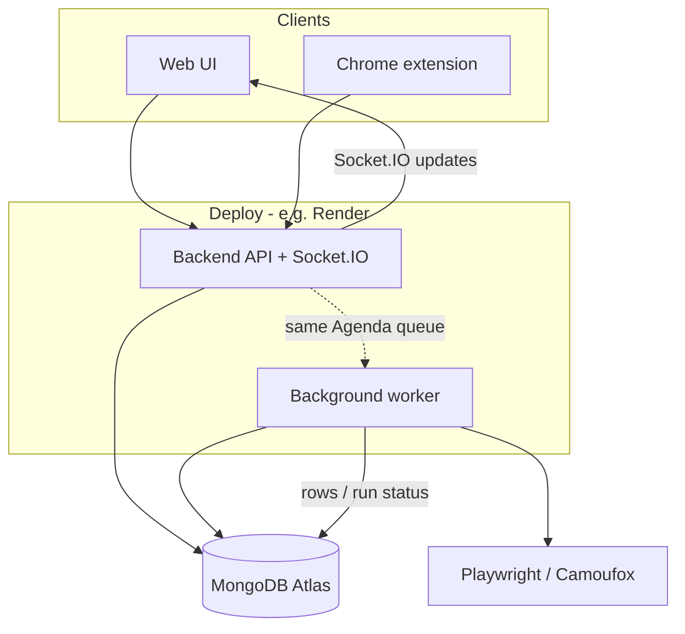
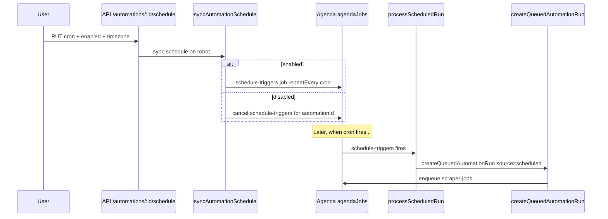
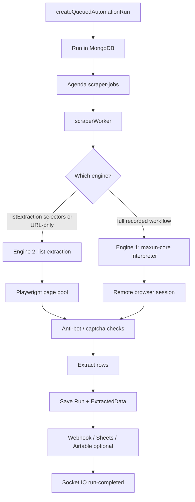

# Scout-X — How the Project, Scheduler, and Scraper Work

Short guide to the whole system, with more detail on **scheduling** and **scraping** (including both engines), plus a section on the **Render free-plan limit** issue.

---

## 1. What this project is

**Scout-X** (Maxun-based) is a no-code web scraping app for job / list extraction:

| Piece | Role |
|--------|------|
| `src/` | React + Vite UI |
| `server/` | Express API, Socket.IO, Agenda queue, scraper worker |
| `maxun-core/` | Engine 1 — recorded workflow interpreter |
| `browser/` | Optional remote Playwright browser service |
| `chrome-extension/` | Visual list picker → “Send to Maxun” |
| MongoDB | Users, robots, runs, extracted rows, Agenda jobs |

Users create **automations (robots)**, run them manually or on a **cron schedule**, extract rows into MongoDB, and optionally push to Sheets / Airtable / webhooks / n8n.

---

## 2. Whole project flow (high level)

**Typical path**

1. Create automation (UI or extension) → saved as a **Robot** in MongoDB.
2. Run now **or** enable a schedule.
3. A **Run** document is created and a job is put on the **Agenda** queue (`agendaJobs`).
4. The **worker** opens a browser, scrapes, writes **ExtractedData**, updates the Run.
5. UI gets live updates over Socket.IO (`/queued-run`).

Schedule and scrape share the same queue. The scheduler only *starts* runs; the scraper does the real work.

---

## 3. Scheduler — how it works

### Idea

The scheduler is an **alarm clock in MongoDB** (Agenda). When the cron fires, it does **not** scrape. It only calls the same “create a queued run” path as a manual click of **Run**.

### Where the schedule is stored

On the Robot:

- Primary (SaaS / extension): `recording_meta.saasConfig.schedule`
- Also may exist: `robot.schedule`

Fields: `enabled`, `cron`, `timezone` (optional interval `every`).

Effective schedule = merge of root + `saasConfig` (`resolveEffectiveScheduleState`).

### Lifecycle

### Important pieces

| Step | Code / job | What happens |
|------|------------|--------------|
| Save schedule | `PUT /api/automations/:id/schedule` | Validates cron/TZ, writes `saasConfig.schedule`, calls `syncAutomationSchedule` |
| Register cron | `scheduleRecurringTrigger` | Agenda job name `schedule-triggers`, unique per `automationId` |
| Boot recovery | `rehydrateAutomationSchedules` | On server start, re-registers all enabled schedules |
| Cron fire | `processScheduledRun` | Loads robot → if still enabled → `createQueuedAutomationRun({ source: 'scheduled' })` |
| Manual run | `POST /api/automations/:id/run` | Same `createQueuedAutomationRun({ source: 'manual' })` |

### After a schedule fires

1. `Run` created (`status` starts as scheduled/pending).
2. Agenda **`scraper-jobs`** enqueued.
3. Robot `lastRunAt` / `nextRunAt` updated.
4. Scraper worker picks up the job (next section).

**Requirement:** A process must register the schedule processor and keep Agenda running (API with embedded workers, or a separate `npm run worker`). If the worker is down, schedules may still create jobs that sit forever, or nothing runs.

---

## 4. Scraper — how it works

### Idea

Every scrape (manual or scheduled) becomes one Agenda job: **`scraper-jobs`**.

`createQueuedAutomationRun` → creates `Run` → `enqueueScraperRun` → `scraperWorker.processScraperJob`.

### Scrape pipeline

### Shared worker steps (both engines)

1. Load `Run` + `Robot`.
2. Mark run `running`; notify UI.
3. Build **identity profile**: proxy, user-agent, stealth, optional session reuse.
4. On known anti-bot hosts (Microsoft careers, Amazon jobs, LinkedIn, Workday, etc.), retries may switch to **Camoufox** or visible browser.
5. Run with timeout (`SCRAPER_JOB_TIMEOUT_MS`, default ~120s).
6. Up to **3 attempts** on recoverable failures; captcha usually fails without blind retry.
7. Persist results; destroy/release browser; emit Socket.IO events.

Concurrency: `SCRAPER_WORKER_CONCURRENCY` (default 3) = parallel scraper jobs **per worker process**.

---

## 5. Two scrape engines

### Engine 1 — Recorded workflow (`maxun-core`)

**When:** Robot has a real recorded workflow (Where/What pairs), not just list-extraction config.

**How:**

1. Worker allocates a **remote browser** for the run.
2. `processRunExecution` drives Playwright through the recorded steps.
3. `maxun-core` **Interpreter** + browser-side helpers (`scraper.js`) run actions like `goto`, click, `scrapeList`, `scrapeSchema`.
4. Output lands on the Run; then same persist/webhook path.

**Used for:** Classic Maxun “record in the cloud browser” robots.

### Engine 2 — Configured list extraction (main SaaS / extension path)

**When:** `saasConfig.listExtraction` has `itemSelector` + field selectors (from Chrome extension “Send to Maxun”), or a URL-only “smart” automation.

**How:**

1. Lease a page from **browser reuse pool** (lighter than a full remote recording session).
2. Open target URL; apply runtime config.
3. Wait out Cloudflare / Amazon / Microsoft challenges when possible.
4. Human-like mouse + delays.
5. `runListExtraction()` (`listExtractor.ts`):
   - Match list items by CSS
   - Map fields
   - Paginate (next button / infinite scroll / page loop)
   - Dismiss overlays; optional captcha gate
6. Write rows → `persistExtractedDataForRun` → collection `maxun_extracteddata`.
7. Optional destinations + Socket.IO.

**Used for:** Job-board list scrapes configured in the extension — the path Scout-X leans on most.

| | Engine 1 | Engine 2 |
|--|----------|----------|
| Config source | Recorded `workflow` | `saasConfig.listExtraction` |
| Browser | Remote browser per run | Pooled Playwright page |
| Core code | `maxun-core` Interpreter | `listExtractor` + `processConfiguredListExtraction` |
| Best for | Multi-step recorded flows | List/table job extraction |

---

## 6. Manual vs scheduled (same scrape)

| | Manual | Scheduled |
|--|--------|-----------|
| Trigger | `POST /api/automations/:id/run` | Agenda `schedule-triggers` |
| Run flag | `source: 'manual'` | `source: 'scheduled'` |
| After that | Identical `scraper-jobs` → worker → Engine 1 or 2 → MongoDB |

---

## 7. Key files (quick map)

| Area | Path |
|------|------|
| Schedule API | `server/src/api/automations.ts` |
| Schedule sync / fire | `server/src/services/automationScheduler.ts` |
| Create run + enqueue | `server/src/services/automationRun.ts` |
| Agenda queue | `server/src/queue/scraperQueue.ts` |
| Scraper worker | `server/src/workers/scraperWorker.ts` |
| List extract (Engine 2) | `server/src/services/listExtractor.ts` |
| Recorded engine (Engine 1) | `maxun-core/src/interpret.ts`, `maxun-core/src/browserSide/scraper.js` |
| Render deploy | `docs/render-deployment.md` |

---

## 8. Render free plan — why “only 6 companies” still hit the limit

### What happened

You deployed Scout-X on **Render (free / Hobby)**, scraped a small set (about **six companies / jobs**), and got mail that **Render reached its limit**. That felt wrong because the scrape volume was tiny.

### Important clarification

**Render does not limit you by “number of companies scraped.”**  
The email is about **platform quotas** (instance hours, bandwidth, build minutes), not Maxun job count. Six scrapes can still burn those quotas if the **services themselves** are expensive or always on.

### What the free plan actually caps

Rough free/Hobby constraints (Render docs):

| Limit | Why it matters for Scout-X |
|--------|----------------------------|
| **~750 free instance hours / month** | Shared across free **running** services. One always-on service ≈ 24×30 ≈ **720 hours** → almost the whole month. **Two** always-on services (API + worker) ≈ **1440 hours** → over the limit mid-month even with **zero** scrapes. |
| **512 MB RAM / weak CPU** on free web instances | Playwright + Chromium often needs **1–2+ GB**. Browser launch → OOM/crash → restart loops → more hours + failed runs. |
| **Outbound bandwidth** (Hobby often only a few GB) | Loading job sites, assets, retries, screenshots can chew bandwidth fast. |
| **Build pipeline minutes** (~500/month) | Worker build installs Playwright Chromium (`build:render-worker`). Redeploys and crash-redeploys burn minutes quickly. |
| **Web spin-down after ~15 min idle** | Free **web** services sleep when idle. Schedules + scrapes wake them; cold starts + flaky Socket.IO. Background workers behave differently and are a poor fit for “free forever” scraping. |

Your deploy guide itself expects **three** Render pieces: static frontend + **backend web service** + **background worker** — that pattern is heavy for free tier.

### Why six scrapes still hurt

Each “company” run is not one cheap HTTP call. For each automation run the worker may:

1. Start or reuse **Chromium** (hundreds of MB RAM).
2. Hit anti-bot pages → wait (Cloudflare / Microsoft / Amazon) up to tens of seconds.
3. **Retry up to 3 times**, sometimes switching browser strategy (even heavier).
4. Scroll / paginate / extract for up to `SCRAPER_JOB_TIMEOUT_MS` (default **120s**).
5. Default **`SCRAPER_WORKER_CONCURRENCY=3`** — multiple browsers at once on a 512 MB box → crashes.

So: **6 companies ≠ 6 light API calls.** They can mean many minutes of browser time, retries, and memory spikes — on top of the API + worker already consuming instance hours 24/7.

### Likely root causes (ordered)

1. **Instance hours from API + worker always running** — main suspect for a “limit reached” email with little scrape volume.
2. **Playwright on free RAM** — OOM / restarts inflate usage and make scrapes fail or retry.
3. **Concurrency too high** (`SCRAPER_WORKER_CONCURRENCY=3`) for free instances.
4. **Redeploys / worker rebuilds** eating **build minutes**.
5. **Bandwidth** if many page loads / assets / retries (less common than hours, but possible on tight Hobby bandwidth).

### What to do

**Short term (stay cheap)**

- Prefer **one** process with `RUN_EMBEDDED_WORKERS=true` instead of separate free API + free worker (still tight, but half the instance-hour burn).
- Set `SCRAPER_WORKER_CONCURRENCY=1`.
- Lower `SCRAPER_JOB_TIMEOUT_MS` (e.g. 60000).
- Pause schedules when not needed; don’t leave crons firing all month on free tier.
- Avoid frequent redeploys of the worker (Chromium install is costly).
- Watch **Billing → usage** in Render: instance hours vs bandwidth vs pipeline minutes — see which bar hit 100%.

**Real fix for scraping**

- Free Render is a bad fit for Playwright scrapers. Use at least a **paid** instance with **≥1–2 GB RAM** for the worker (or move worker + browser to a VPS / Railway / Fly with enough memory).
- Keep MongoDB on Atlas (already external); don’t expect free Render to host browsers reliably.

**How to confirm**

In Render dashboard, open the usage email / Billing and note which meter tripped:

- Instance hours → too many always-on services  
- Pipeline minutes → too many builds  
- Bandwidth → too much outbound traffic  

That tells you the fix (merge services / upgrade RAM / fewer deploys / throttle scrapes).

---

## 9. One-line mental model

- **Scheduler** = Agenda cron that only enqueues a run.  
- **Scraper** = Agenda worker that opens a browser and fills MongoDB (Engine 1 = recorded workflow, Engine 2 = list selectors).  
- **Render free limit** = platform hours/RAM/builds — not “you scraped more than 6 companies.”
