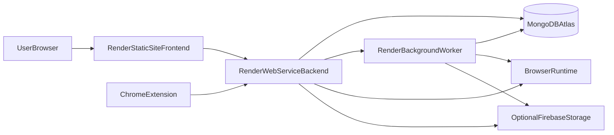

# Render Deployment Guide (Scout-X Scrapper)

This guide shows how to deploy Scout-X Scrapper on Render with production-safe defaults.

## Architecture overview



## Required inputs (before you start)

- Render account and linked Git repository
- **`package-lock.json` committed at the repo root** (Render builds use clean install + `npm ci`)
- **`npm ci --include=dev`** (or `npm run install:ci`) on Render — Render sets `NODE_ENV=production` during builds, so plain `npm ci` skips `devDependencies`; the server compile needs them (`typescript`, `@types/*`, `@modelcontextprotocol/sdk`, `zod`, etc.)
- MongoDB Atlas connection string (`MONGODB_URI`)
- Two public URLs:
  - frontend URL (for `PUBLIC_URL` / `VITE_PUBLIC_URL`)
  - backend URL (for `BACKEND_URL` / `VITE_BACKEND_URL`)
- Strong secrets:
  - `JWT_SECRET`
  - `SESSION_SECRET`
  - `ENCRYPTION_KEY` (64 hex chars recommended)
- Decide deployment model:
  - **Render Free Tier (Recommended for Free tier)**: Single Web Service with `RUN_EMBEDDED_WORKERS=true`, `SCRAPER_WORKER_CONCURRENCY=1`, and `SCRAPER_JOB_TIMEOUT_MS=60000`. This uses 1 service (~720 instance hrs/mo) fitting inside Render's 750 free instance hours.
  - **Paid / Dedicated Production**: Separate Web Service + Background Worker service with `RUN_EMBEDDED_WORKERS=false` and `SCRAPER_WORKER_CONCURRENCY=3`.

## Services to create on Render

### Track A: Render Free Tier (2 Services Total - Saves Instance Hours & RAM)
1. **Static Site**: Frontend UI
2. **Web Service**: Backend API + Socket.IO + Embedded Workers (`RUN_EMBEDDED_WORKERS=true`)

### Track B: Paid / High Performance (3 Services Total)
1. **Static Site**: Frontend UI
2. **Web Service**: Backend API + Sockets (`RUN_EMBEDDED_WORKERS=false`)
3. **Background Worker**: Queue & Scraper worker

---

## 1) Frontend (Render Static Site)

- Root directory: repository root
- Build command:

```bash
npm ci --include=dev && npm run build
```

- Publish directory:

```bash
build
```

- Environment variables:
  - `VITE_BACKEND_URL=https://<your-backend-domain>`
  - `VITE_PUBLIC_URL=https://<your-frontend-domain>`

## 2) Backend (Render Web Service)

- Root directory: repository root
- Build command (installs dependencies, builds server, and installs Chromium for scraping):

```bash
npm ci --include=dev && npm run build:server && npm run playwright:install
```

- Start command:

```bash
npm run server
```

- Health check path:

```text
/
```

### Backend environment variables

Set at least:

- `NODE_ENV=production`
- `MONGODB_URI=<atlas-uri>`
- `JWT_SECRET=<strong-secret>`
- `SESSION_SECRET=<strong-secret>`
- `ENCRYPTION_KEY=<64-char-hex>`
- `BACKEND_URL=https://<your-backend-domain>`
- `PUBLIC_URL=https://<your-frontend-domain>`
- `VITE_BACKEND_URL=https://<your-backend-domain>`
- `VITE_PUBLIC_URL=https://<your-frontend-domain>`
- `RUN_EMBEDDED_WORKERS=true` *(Use `true` on Free Tier; use `false` if running a separate worker service)*
- `SCRAPER_WORKER_CONCURRENCY=1` *(Use `1` on 512MB RAM Free Tier; use `3` on paid instances with ≥1-2GB RAM)*
- `SCRAPER_JOB_TIMEOUT_MS=60000`
- `LOGS_PATH=server/logs`

Optional:

- `DEFAULT_PROXY_URL=`
- `PROXY_POOL=`
- `GOOGLE_CLIENT_ID=...`
- `GOOGLE_CLIENT_SECRET=...`
- `GOOGLE_REDIRECT_URI=...`
- `AIRTABLE_CLIENT_ID=...`
- `AIRTABLE_REDIRECT_URI=...`
- Firebase vars (if using cloud screenshot/object storage)
- Browser vars (`BROWSER_WS_HOST`, `BROWSER_WS_PORT`, `BROWSER_HEALTH_PORT`)
- Camoufox vars (`DEFAULT_BROWSER_TYPE=camoufox`, `CAMOUFOX_WS_*`)

## 3) Worker (Render Background Worker)

- Root directory: repository root

Worker builds compile the server with **`npm run build:server`** and install Chromium for Playwright. On Render, **`NODE_ENV=production`** during build causes plain **`npm ci`** to skip **`devDependencies`**, which breaks TypeScript (`@modelcontextprotocol/sdk`, `zod`, `@types/*`, etc.). Use **`npm ci --include=dev`** or **`npm run build:render-worker`**.

- Build command:

```bash
npm run build:render-worker
```

(equivalent: `npm ci --include=dev && npm run build:server && npm run playwright:install`)

- Start command:

```bash
npm run worker
```

- Copy the **same env vars as the backend** (MongoDB URI, secrets, `RUN_EMBEDDED_WORKERS=false`, browser/proxy/storage as needed).

## Connection rules (important)

- `PUBLIC_URL` must be the frontend origin exactly (used by CORS/session config).
- `BACKEND_URL` must be the backend origin exactly.
- `VITE_BACKEND_URL` should equal `BACKEND_URL`.
- `VITE_PUBLIC_URL` should equal `PUBLIC_URL`.
- If `RUN_EMBEDDED_WORKERS=false`, the background worker service must be running or jobs will stay queued.

## Browser strategy on Render

Start with default Playwright strategy:

- `DEFAULT_BROWSER_TYPE=playwright`
- No custom browser host vars unless you run a dedicated browser runtime

If you use remote browser runtime:

- Point `BROWSER_WS_HOST` / `BROWSER_HEALTH_PORT` to reachable host/ports
- Ensure backend and worker can reach that host

Camoufox:

- Use only if you intentionally run and maintain the Camoufox sidecar/runtime
- Set `DEFAULT_BROWSER_TYPE=camoufox` and `CAMOUFOX_WS_*` values

For anti-bot job boards (Microsoft, Amazon, etc.), use residential proxy settings (`DEFAULT_PROXY_URL` / `PROXY_POOL` + Proxy page config).

## Deployment checklist (step-by-step)

1. Create MongoDB Atlas database and verify network access.
2. Create Render backend web service with build/start commands above.
3. Add backend env vars and deploy.
4. Create Render background worker with build/start commands above.
5. Copy backend env vars to worker and deploy.
6. Create frontend static site, set `VITE_*` vars, and deploy.
7. Verify frontend can login and open dashboard.
8. Run one automation and confirm run progresses from queued to completed/failed with logs.

## Post-deploy verification

Backend checks:

- Open `https://<backend>/` and confirm it responds.
- Open `https://<backend>/api-docs` and confirm API docs load.

Functional checks:

- Login from frontend.
- Create/run one automation.
- Confirm queue events update dashboard.
- Open run details and confirm logs/screenshot sections update.
- Confirm schedule pause/resume works.

Worker checks:

- Ensure queued runs are consumed.
- Ensure retries/re-enqueues are visible in run logs.

## Troubleshooting

### 1) CORS/auth/session issues

Symptoms:

- Login fails or cookies not persisted
- API calls from frontend blocked

Fix:

- Ensure `PUBLIC_URL` exactly matches frontend origin
- Ensure `BACKEND_URL` and `VITE_BACKEND_URL` match backend origin
- Keep `NODE_ENV=production` and strong `SESSION_SECRET`

### 2) Runs stay queued

Symptoms:

- Automations enqueue but never start

Fix:

- Confirm worker service is running
- Confirm `RUN_EMBEDDED_WORKERS=false` on backend and worker exists
- Confirm backend and worker share same `MONGODB_URI`

### 3) Browser connection failures

Symptoms:

- `page.goto` network failures or browser startup errors

Fix:

- Start with default Playwright setup
- If using remote browser runtime, verify `BROWSER_WS_*` reachability
- For anti-bot targets, configure residential proxy

### 4) CAPTCHA-heavy targets (Microsoft/Amazon/etc.)

Symptoms:

- Frequent CAPTCHA in run logs

Fix:

- Configure residential proxy in Proxy settings
- Reduce run frequency
- Use adaptive retry/browser strategies already in worker logic

### 5) Optional Firebase storage not working

Symptoms:

- No uploaded screenshots/artifacts

Fix:

- Verify Firebase credential envs and bucket config
- If not needed, leave Firebase vars unset (app still runs)

### 6) Render Free Plan Limit / Quota Exhaustion Email

Symptoms:

- Email from Render: "Render account reached free plan limit" after only a few scrapes.

Fix & Explanation:

- **Why it happens**: Render limits platform **instance hours** (750 hrs/month), not job count. Running 2 separate services (Web Service + Background Worker) consumes 2 x 720 = ~1440 instance hours per month, blowing past the free limit mid-month even with 0 scrapes.
- **Fix**:
  1. Switch to Single-Service Embedded Worker Mode: Delete the separate Background Worker service on Render. Set `RUN_EMBEDDED_WORKERS=true` on the Web Service.
  2. Set `SCRAPER_WORKER_CONCURRENCY=1` to prevent Out-Of-Memory (OOM) memory crash loops on 512 MB RAM.
  3. Set `SCRAPER_JOB_TIMEOUT_MS=60000`.
  4. Ensure backend build command includes Chromium install: `npm ci --include=dev && npm run build:server && npm run playwright:install`.

## Rollback strategy

- Keep previous successful Render deploy as rollback target.
- If new deploy breaks:
  1. rollback backend service
  2. rollback worker service
  3. rollback frontend service
- Re-run one automation to verify queue + worker + UI path.

## Related docs

- [production-deployment.md](./production-deployment.md)
- [native-browser-setup.md](./native-browser-setup.md)
- [ENVEXAMPLE](../ENVEXAMPLE)
