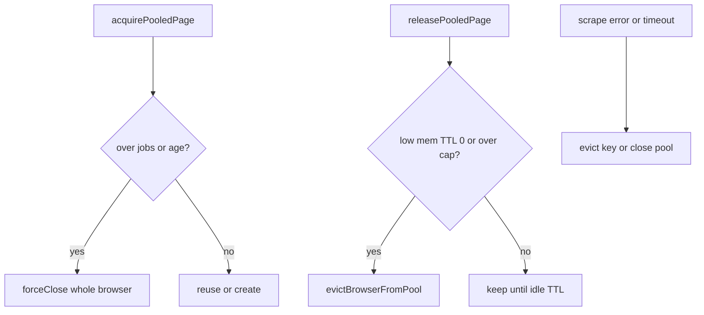

# Browser Lifecycle Recycle (Lean)

**Date:** 2026-08-08  
**Status:** Implemented  
**Product:** Scout-X collection (Playwright reuse pool)

## Problem

Pooled Chromium processes grow memory and can stay “sick” after navigation/anti-bot failures if only the page is closed. With `SCRAPE_JOB_CHILD_PROCESS=true`, each Agenda job already dies with its child, so cross-job leaks in production are mostly gone. In-process mode and multi-page reuse within one job still need caps.

## Solution

Lean lifetime caps on `browserReusePool` entries:

1. **`jobsServed`** — increment on successful page acquire; retire when `>= BROWSER_POOL_MAX_JOBS` (default **20**, **1** in low-memory).
2. **`createdAt` / max age** — retire when age `>= BROWSER_POOL_MAX_AGE_MS` (default **15m**, **5m** in low-memory).
3. **Error = whole browser gone** — acquire failure, extraction/navigation errors (except `RunDriftError`), retries, and in-process timeout still call `evictBrowserFromPool` / `forceCleanupJobBrowsers`.

Idle TTL and low-memory close-after-job behavior are unchanged.

## Files

| File | Role |
|------|------|
| `server/src/utils/memoryMode.ts` | `getBrowserPoolMaxJobs` / `MaxAgeMs`, `shouldRetirePooledBrowser` |
| `server/src/services/browserReusePool.ts` | Track `createdAt` / `jobsServed`; retire on acquire/cleanup/release |
| `server/src/workers/scraperWorker.ts` | Evict pool on non-drift extraction errors; existing timeout/retry eviction |

## Env

- `BROWSER_POOL_MAX_JOBS` (default 20; low-mem 1)
- `BROWSER_POOL_MAX_AGE_MS` (default 900000; low-mem 300000)
- Existing: `BROWSER_POOL_IDLE_TTL_MS`, `BROWSER_POOL_MAX_PAGES`

## Non-goals

cgroups / hard RSS kill; PM2 topology changes; missed-schedule catch-up; DNS overrides.
