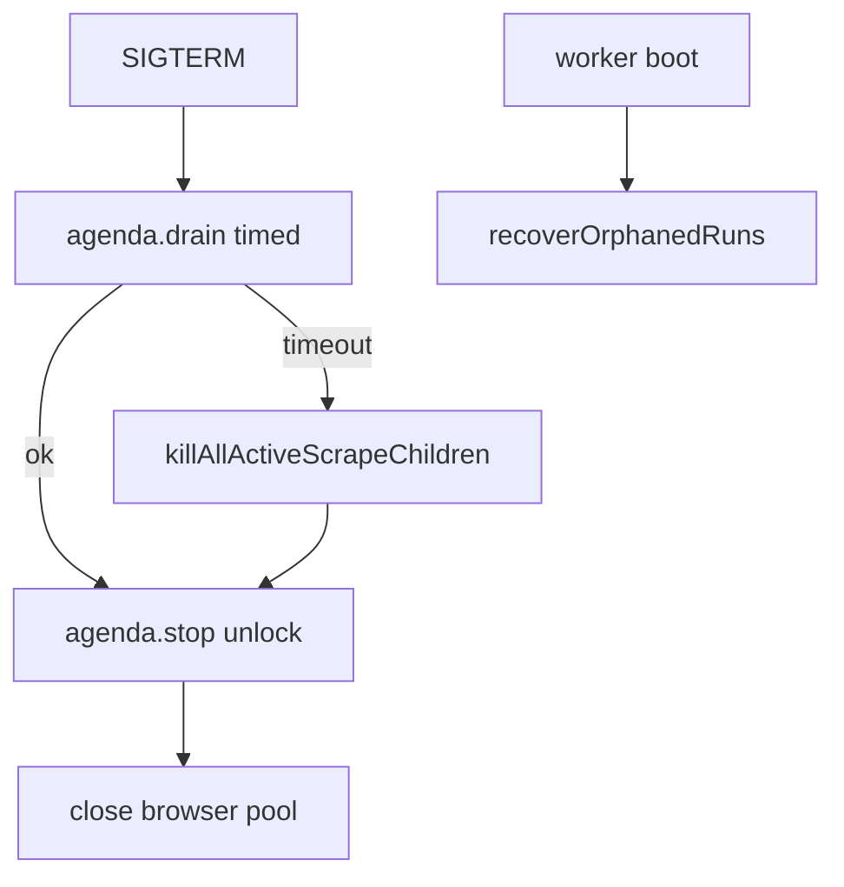

# Graceful Drain on Deploy (Lean)

**Date:** 2026-08-08  
**Status:** Implemented  
**Product:** Scout-X collection (Agenda scraper worker)

## Problem

SIGTERM / PM2 restarts hard-cut mid-scrape. Agenda unlocked immediately via `stop()` without waiting, children could outlive the parent, and locks defaulted to **10 minutes**. Orphaned `running` runs were only recovered on API boot — useless when only `scoutx-scraper` restarts.

## Solution

1. **`drainAndCloseAgenda`** — `agenda.drain()` with `Promise.race` timeout (`SCRAPE_DRAIN_MS`, default 90s), then `stop()` + `close()`.
2. **Track + kill scrape children** on shutdown after drain.
3. **Shorter `lockLifetime`** on `scraper-jobs` = `SCRAPER_JOB_TIMEOUT_MS + 60s`.
4. **`recoverOrphanedRuns({ assumeNoBrowsers: true })`** on worker boot.
5. **API handles SIGTERM**; PM2 `kill_timeout` ≥ drain window on scraper.

## Env

- `SCRAPE_DRAIN_MS` (default `90000`) — must stay below PM2 `kill_timeout` (scraper: `120000`)

## Non-goals

Custom heartbeat leases; DNS override removal; blue/green orchestration beyond PM2.
