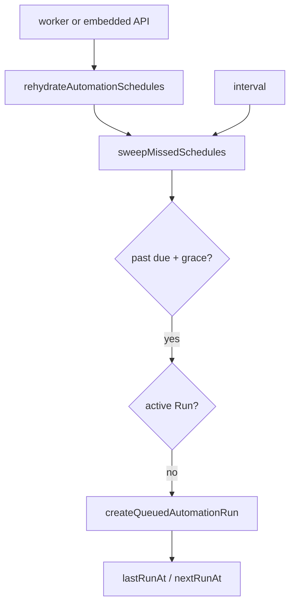

# Missed-Schedule Catch-Up

**Date:** 2026-08-08  
**Status:** Implemented  
**Product:** Scout-X collection (Agenda schedules)

## Problem

Agenda `repeatEvery` skips an occurrence if the scheduler was down when it should have fired. A deploy or crash at the wrong minute silently drops a company’s scrape until the next tick.

## Solution

1. **`isScheduleOverdue`** — pure dueAt + grace check (interval: `lastRunAt + everyMs`; else past `nextRunAt`).
2. **`sweepMissedSchedules`** — enqueue **at most one** catch-up run per overdue robot; skip if an active Run exists (`pending` / `queued` / `running` / `scheduled`).
3. **Single-flight in `processScheduledRun`** — Agenda late fires do not stack on top of a catch-up.
4. **Loop** — run immediately after rehydrate, then every `SCHEDULE_CATCHUP_INTERVAL_MS` on the worker (and embedded API only).

## Files

| File | Role |
|------|------|
| `server/src/utils/schedule.ts` | `isScheduleOverdue`, catch-up env readers |
| `server/src/services/automationScheduler.ts` | Sweep + single-flight + catch-up loop |
| `server/src/worker.ts` | Start loop after rehydrate |
| `server/src/server.ts` | Start loop only when embedded workers |

## Env

- `SCHEDULE_CATCHUP_GRACE_MS` (default `120000`)
- `SCHEDULE_CATCHUP_INTERVAL_MS` (default `120000`)
- `SCHEDULE_CATCHUP_MAX_ROBOTS` (default `40`)

## Non-goals

Multi-interval backlog catch-up; graceful drain; DNS override removal.
